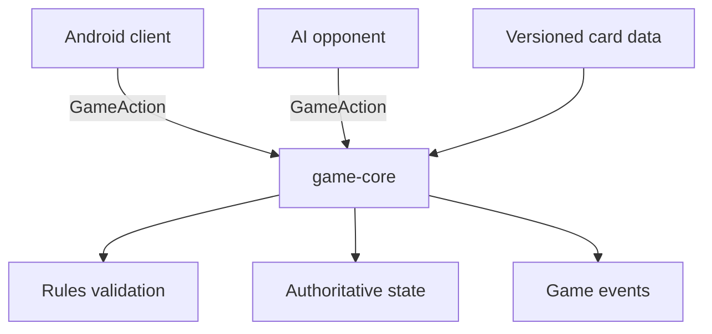

# Architecture

## Principle

Infinite Conquest is a tactical card-game engine with clients. The engine is authoritative; clients render state and submit actions.

## Dependency direction

- `game-core`: pure Java rules, state, actions, deterministic randomness.
- future `game-data`: versioned definitions and typed effect registry.
- future `app`: Android presentation; depends on core, never the reverse.
- future `tools`: simulations, card validation, balance reports.

## State and actions

Board coordinates and ordered stacks are data, not visual placement. A client requests actions; `GameEngine` validates and returns a result. The AI must use this same API.

## Determinism

Every match stores a seed. Random behavior will use an injectable provider and action logs so defects can be replayed.
